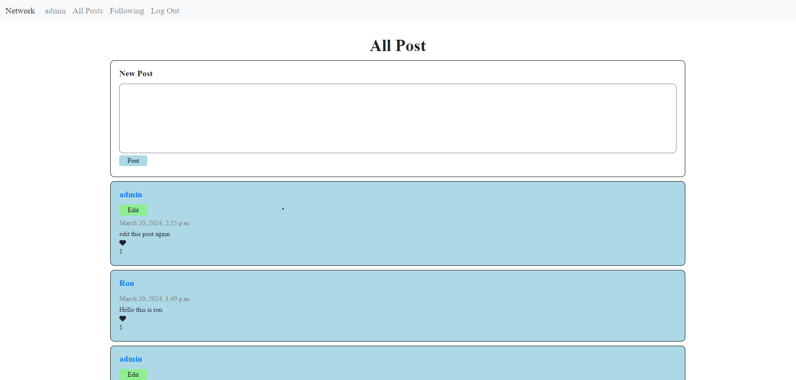
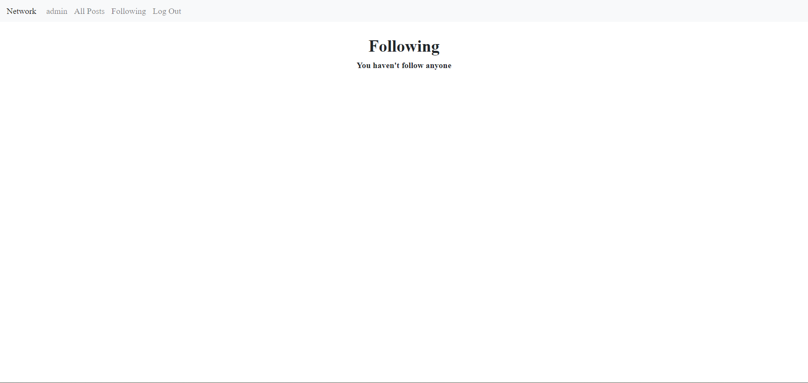
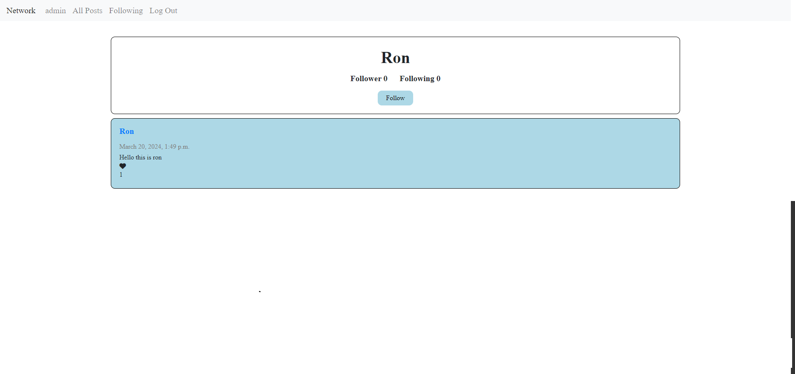
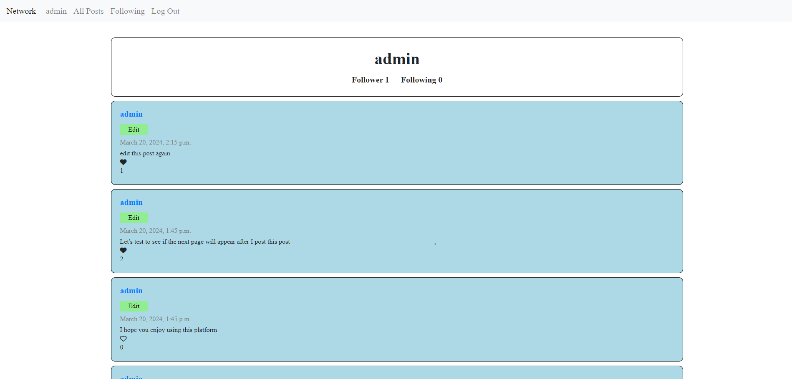

# Project 4 - Network

&nbsp;&nbsp;&nbsp;&nbsp;This is my fifth project in my CS50’s Web Programming with Python and JavaScript course that I taken. In this project, I have to design a Twitter-like social network website for making posts and following users.

## Specification

* New Post
    * Users who are signed in will be able to write a new text-based post by filling in text into a text area and then clicking a button to submit the post.

* All Posts
    * The “All Posts” link in the navigation bar will take the user to a page where they can see all posts from all users, with the most recent posts first.
    * Each post will include the username of the poster, the post content itself, the date and time at which the post was made, and the number of “likes” the post has

* Profile Page
    * Clicking on a username will load that user’s profile page. 
    * Display the number of followers the user has, as well as the number of people that the user follows.
    * Display all of the posts for that user, in reverse chronological order.
    * For any other user who is signed in, this page will also display a “Follow” or “Unfollow” button that will let the current user toggle whether or not they are following this user’s posts. Note that this only applies to any “other” user: a user will not be able to follow themselves.

* Following
    * The “Following” link in the navigation bar will take the user to a page where they see all posts made by users that the current user follows.
    * This page will behave just as the “All Posts” page does, just with a more limited set of posts.
    * This page will only be available to users who are signed in.

* Pagination
    * On any page that displays posts, posts will only be displayed 10 on a page. If there are more than ten posts, a “Next” button will appear to take the user to the next page of posts (which should be older than the current page of posts). If not on the first page, a “Previous” button will appear to take the user to the previous page of posts as well.

* Edit
    * Users should will able to click an “Edit” button or link on any of their own posts to edit that post.
    * When a user clicks “Edit” for one of their own posts, the content of their post will be replaced with a textarea where the user can edit the content of their post.
    * The user will then be able to “Save” the edited post without reloading the pages.
    * THe application is designed such that it is not possible for a user, via any route, to edit another user’s posts.

* “Like” and “Unlike”
    * Users should be able to click a button or link on any post to toggle whether or not they “like” that post.

## Pages

### Home Page

### Following Page

### Other Profile Page

### Profile Page

## Video Explaination

Video : https://www.youtube.com/watch?v=aylzFQNIINk
